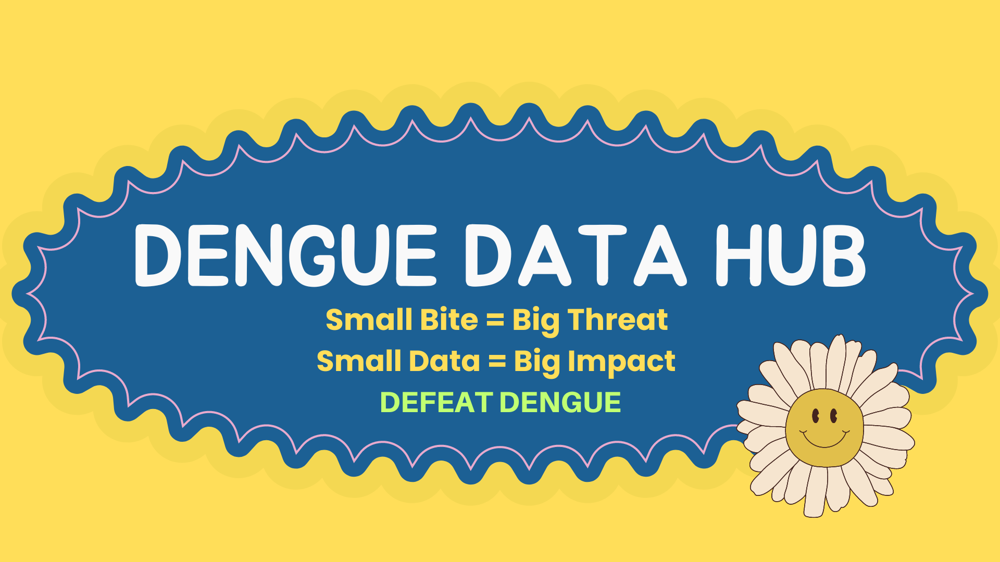

<!-- README.md is generated from README.Rmd. Please edit that file -->

```{r, include = FALSE}
knitr::opts_chunk$set(
  collapse = TRUE,
  comment = "#>",
  fig.path = "man/figures/README-",
  out.width = "100%"
)
```

[](https://github.com/thiyangt/denguedatahub/actions/workflows/R-CMD-check.yaml)

# denguedatahub 

The goal of `denguedatahub` is to provide the research community with a unified dataset by collecting worldwide dengue-related data, merged with exogenous variables helpful for a better understanding of the spread of dengue and the reproducibility of research.



Check out the website at https://denguedatahub.netlify.app/

## Installation

You can install the development version of denguedatahub from [GitHub](https://github.com/) with:

```r
install.packages("denguedatahub")
```

``` r
# install.packages("devtools")
devtools::install_github("thiyangt/denguedatahub")
```

## Example

This is a basic example which shows you how to solve a common problem:

```{r example}
library(tsibble)
library(denguedatahub)
head(level_of_risk)
```

## Sri Lanka Weekly Dengue Cases

```{r}
head(srilanka_weekly_data)
library(ggplot2)
library(viridis)
library(dplyr)
ggplot(
  filter(srilanka_weekly_data, year < 2019 & year > 2012),
  aes(
    x = week,
    y = district,
    fill = cut(
      cases,
      breaks = c(0, 50, 100, 200, Inf),
      labels = c("0–50", "50–100", "100–200", ">200"),
      include.lowest = TRUE,
      right = FALSE
    )
  )
) +
  geom_tile(color = "white") +
  scale_fill_viridis_d(
    option = "C",
    name = "Dengue Cases"
  ) +
  facet_wrap(~year, ncol = 3) +
  labs(
    title = "Weekly Dengue Cases by District in Sri Lanka (2012–2019)",
    x = "Week Number",
    y = "District"
  ) +
  theme_minimal(base_size = 12) +
  theme(
    axis.text.x = element_text(angle = 90, hjust = 1, size = 6),
    axis.text.y = element_text(size = 7),
    legend.position = "bottom",
    strip.text = element_text(size = 9)
  )


ggplot(
  filter(srilanka_weekly_data, year > 2019),
  aes(
    x = week,
    y = district,
    fill = cut(
      cases,
      breaks = c(0, 50, 100, 200, Inf),
      labels = c("0–50", "50–100", "100–200", ">200"),
      include.lowest = TRUE,
      right = FALSE
    )
  )
) +
  geom_tile(color = "white") +
  scale_fill_viridis_d(
    option = "C",
    name = "Dengue Cases"
  ) +
  facet_wrap(~year, ncol = 3) +
  labs(
    title = "Weekly Dengue Cases by District in Sri Lanka (2020–2025)",
    x = "Week Number",
    y = "District"
  ) +
  theme_minimal(base_size = 12) +
  theme(
    axis.text.x = element_text(angle = 90, hjust = 1, size = 6),
    axis.text.y = element_text(size = 7),
    legend.position = "bottom",
    strip.text = element_text(size = 9)
  )


```

## World

```{r, message=FALSE, warning=FALSE}
library(tidyverse)
world_annual |>
  filter(region=="Afghanistan") |>
  head()
```