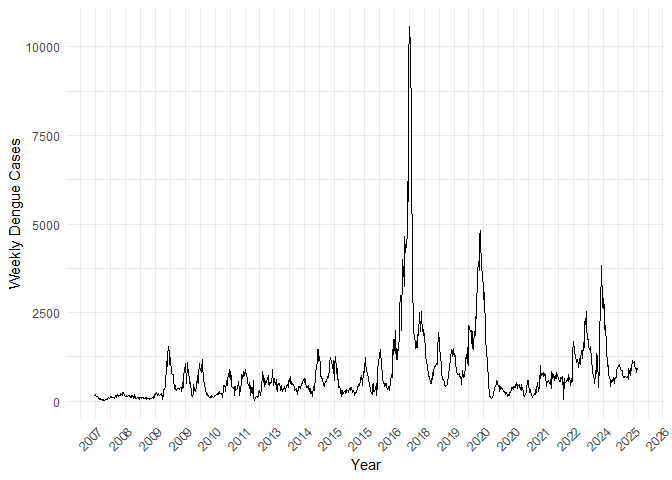
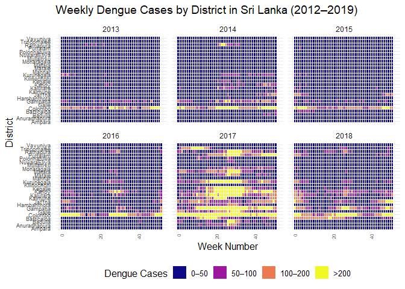
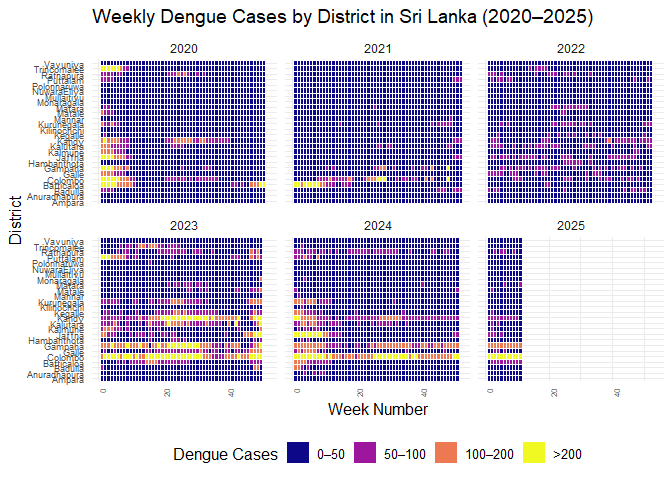

<!-- README.md is generated from README.Rmd. Please edit that file -->

[](https://github.com/thiyangt/denguedatahub/actions/workflows/R-CMD-check.yaml)

# denguedatahub 

The goal of `denguedatahub` is to provide the research community with a
unified dataset by collecting worldwide dengue-related data, merged with
exogenous variables helpful for a better understanding of the spread of
dengue and the reproducibility of research.


Check out the website at <https://denguedatahub.netlify.app/>

## Installation

You can install the development version of denguedatahub from
[GitHub](https://github.com/) with:

``` r
install.packages("denguedatahub")
```

``` r
# install.packages("devtools")
devtools::install_github("thiyangt/denguedatahub")
```

## Example

This is a basic example which shows you how to solve a common problem:

``` r
library(tsibble)
#> Registered S3 method overwritten by 'tsibble':
#>   method               from 
#>   as_tibble.grouped_df dplyr
#> 
#> Attaching package: 'tsibble'
#> The following objects are masked from 'package:base':
#> 
#>     intersect, setdiff, union
library(denguedatahub)
head(level_of_risk)
#> # A tibble: 6 × 4
#>   country      level_of_risk       region last_accessed
#>   <chr>        <chr>               <chr>  <date>       
#> 1 Angola       Sporadic/Uncertain  Africa 2023-01-16   
#> 2 Benin        Sporadic/Uncertain  Africa 2023-01-16   
#> 3 Burkina Faso Frequent/Continuous Africa 2023-01-16   
#> 4 Burundi      Sporadic/Uncertain  Africa 2023-01-16   
#> 5 Cameroon     Sporadic/Uncertain  Africa 2023-01-16   
#> 6 Cape Verde   Sporadic/Uncertain  Africa 2023-01-16
```

## Sri Lanka Weekly Dengue Cases

``` r
head(srilanka_weekly_data)
#> # A tibble: 6 × 6
#>    year  week start.date end.date   district    cases
#>   <dbl> <dbl> <chr>      <chr>      <chr>       <dbl>
#> 1  2006    52 12/23/2006 12/29/2006 Colombo        71
#> 2  2006    52 12/23/2006 12/29/2006 Gampaha        12
#> 3  2006    52 12/23/2006 12/29/2006 Kalutara       12
#> 4  2006    52 12/23/2006 12/29/2006 Kandy          20
#> 5  2006    52 12/23/2006 12/29/2006 Matale          4
#> 6  2006    52 12/23/2006 12/29/2006 NuwaraEliya     1
```

``` r
library(ggplot2)
library(viridis)
#> Loading required package: viridisLite
library(dplyr)
#> 
#> Attaching package: 'dplyr'
#> The following objects are masked from 'package:stats':
#> 
#>     filter, lag
#> The following objects are masked from 'package:base':
#> 
#>     intersect, setdiff, setequal, union

country_weekly <- srilanka_weekly_data |>
  group_by(year, week, start.date) %>%
  summarise(total_cases = sum(cases, na.rm = TRUE), .groups = 'drop') |>
  arrange(start.date)

country_weekly <- country_weekly |> 
  mutate(
         yearweek = yearweek(start.date)) |>
  distinct(yearweek, .keep_all = TRUE) 

country_weekly_tsibble <- country_weekly |>
  as_tsibble(index = yearweek)

p1 <- ggplot(country_weekly_tsibble, aes(x = yearweek, y = total_cases)) +
  geom_line() +
  scale_x_yearweek(date_breaks = "1 year", date_labels = "%Y") +
  labs(
    x = "Year",
    y = "Weekly Dengue Cases"
  ) +
  theme_minimal() +
  theme(
    axis.text.x = element_text(angle = 45, hjust = 1),
    plot.title = element_text(face = "bold")
  )
p1
```



``` r

ggplot(
  filter(srilanka_weekly_data, year < 2019 & year > 2012),
  aes(
    x = week,
    y = district,
    fill = cut(
      cases,
      breaks = c(0, 50, 100, 200, Inf),
      labels = c("0–50", "50–100", "100–200", ">200"),
      include.lowest = TRUE,
      right = FALSE
    )
  )
) +
  geom_tile(color = "white") +
  scale_fill_viridis_d(
    option = "C",
    name = "Dengue Cases"
  ) +
  facet_wrap(~year, ncol = 3) +
  labs(
    title = "Weekly Dengue Cases by District in Sri Lanka (2012–2019)",
    x = "Week Number",
    y = "District"
  ) +
  theme_minimal(base_size = 12) +
  theme(
    axis.text.x = element_text(angle = 90, hjust = 1, size = 6),
    axis.text.y = element_text(size = 7),
    legend.position = "bottom",
    strip.text = element_text(size = 9)
  )
```



``` r


ggplot(
  filter(srilanka_weekly_data, year > 2019),
  aes(
    x = week,
    y = district,
    fill = cut(
      cases,
      breaks = c(0, 50, 100, 200, Inf),
      labels = c("0–50", "50–100", "100–200", ">200"),
      include.lowest = TRUE,
      right = FALSE
    )
  )
) +
  geom_tile(color = "white") +
  scale_fill_viridis_d(
    option = "C",
    name = "Dengue Cases"
  ) +
  facet_wrap(~year, ncol = 3) +
  labs(
    title = "Weekly Dengue Cases by District in Sri Lanka (2020–2025)",
    x = "Week Number",
    y = "District"
  ) +
  theme_minimal(base_size = 12) +
  theme(
    axis.text.x = element_text(angle = 90, hjust = 1, size = 6),
    axis.text.y = element_text(size = 7),
    legend.position = "bottom",
    strip.text = element_text(size = 9)
  )
```



## World

``` r
library(tidyverse)
world_annual |>
  filter(region=="Afghanistan") |>
  head()
#>       long      lat group order      region subregion code year incidence
#> 1 74.89131 37.23164     2    12 Afghanistan      <NA>  AFG 1990     23371
#> 2 74.89131 37.23164     2    12 Afghanistan      <NA>  AFG 1991     25794
#> 3 74.89131 37.23164     2    12 Afghanistan      <NA>  AFG 1992     29766
#> 4 74.89131 37.23164     2    12 Afghanistan      <NA>  AFG 1993     32711
#> 5 74.89131 37.23164     2    12 Afghanistan      <NA>  AFG 1994     34268
#> 6 74.89131 37.23164     2    12 Afghanistan      <NA>  AFG 1995     35823
#>   dengue.present
#> 1            yes
#> 2            yes
#> 3            yes
#> 4            yes
#> 5            yes
#> 6            yes
```
